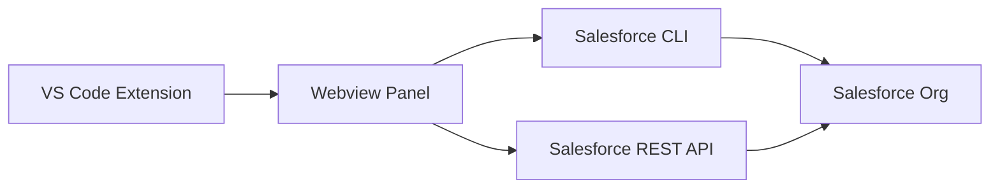

# SF Assistant Project Documentation

## Project Overview

SF Assistant is a VS Code extension that provides Salesforce development tools, including:

- SOQL Query Editor with autocomplete
- Metadata Explorer
- Data Import/Export capabilities
- Integration with Salesforce CLI

## Key Components

### Core Extension Files

- `src/extension.ts` - Main extension entry point
- `src/panelManager.ts` - Manages webview panels and communication
- `src/salesforceService.ts` - Salesforce API integration
- `src/cliValidationService.ts` - SF CLI validation
- `src/utils.ts` - Shared utilities

### Frontend Components

- `webview/` - HTML templates and UI components
- `scripts/` - Browser-side JavaScript modules
- `assets/` - Icons and images

### Configuration

- `package.json` - Extension manifest and configuration
- `webpack.config.js` - Build configuration
- `tsconfig.json` - TypeScript configuration

## Architecture

### Extension Architecture

1. The extension is built on VS Code's Webview API
2. Uses a panel-based UI with two main views:
   - SOQL Query Editor
   - Metadata Explorer
3. Communicates with Salesforce through:
   - SF CLI commands
   - REST API calls

### Communication Flow

### Data Flow

1. User interacts with webview UI
2. Messages sent to extension host
3. Extension processes requests via SF CLI/API
4. Results returned to webview
5. UI updates with results

## Key Features

### SOQL Query Editor

- Syntax highlighting
- Field/object autocomplete
- Query history
- Export results

### Metadata Explorer

- Browse Salesforce objects
- View field definitions
- Navigate relationships
- Tooling API support
